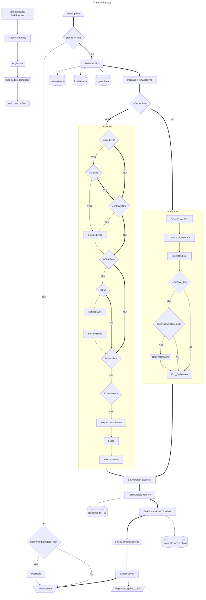
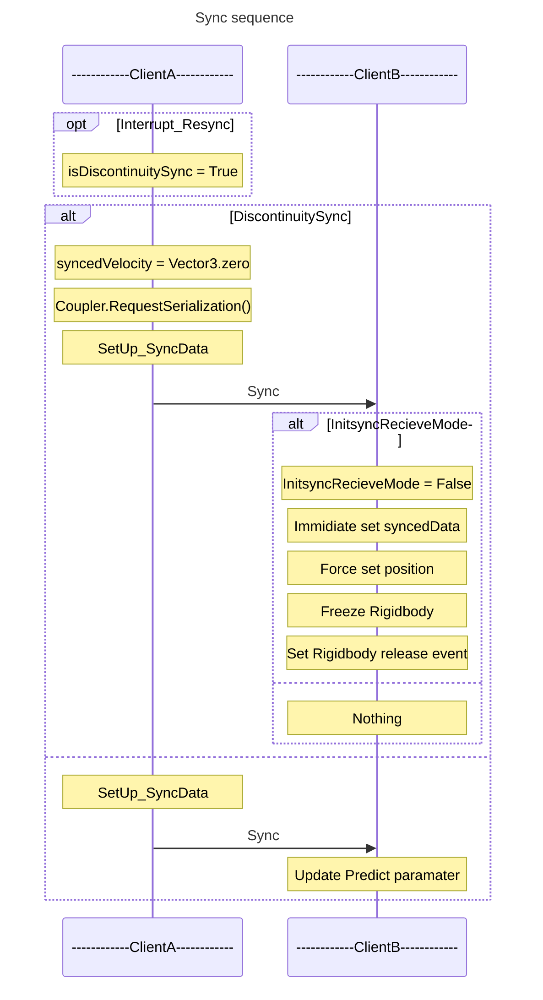

```mermaid
---
title: Train MainLoop
---
flowchart TD
    Start(Start Called By BuildProcess) --> 
    CacheReference --> 
    BogieStart[[BogieStart]] --> 
    SetPositionFromBogie[[SetPositionFromBogie]] -->
    setConnectedTrain[[setConnectedTrain]]
    StartLoop[/FixedUpdate\] ==>
	Started{started == true}


	Started --NO--> IsObjectReady{Networking.IsObjectReady}
	IsObjectReady --YES--> PostStart --> EndLoop
	IsObjectReady --NO--> EndLoop

	Started ==YES==> 
    FetchVelocity ==>
    Increase_FromLastSync ==>
    isOwnerState{isOwnerState} 
    isOwnerState ==YES==> OnOwner ==>
    SetAnimatorParameter
    isOwnerState ==NO==> OnRemote ==>
    SetAnimatorParameter
    SetAnimatorParameter ==>
    FetchGlobalBogiePos ==>
    GetDistanceErrorThreshold ==>
    BogieCalculateNextPos[[BogieCalculateNextPos]] ==>
    ExposeSpeed ==>
	EndLoop[\FixedUpdate/]

    FetchVelocity --> currentVelocity[(currentVelocity)]
    FetchVelocity --> localVelocity[(localVelocity)]
    FetchVelocity --> m_nowSpeed[(m_nowSpeed)]
    FetchGlobalBogiePos --> positionBogie[(positionBogie_F/B)]
    GetDistanceErrorThreshold --> distanceErrorThreshold[(distanceErrorThreshold)]
    ExposeSpeed --> OutPut[/Rigidbody_Speed_LocalZ/]

	subgraph "OnOwner"
        direction TB
		isNeedSync{isNeedSync} --YES--> isMoving{isMoving} --YES--> SetNeedSync1[SetNeedSync]
        isNeedSync ==NO==> onMovingRail
        isMoving ==NO==> onMovingRail
        
        onMovingRail{onMovingRail} --YES--> SetNeedSync1  -->isStopSync
        onMovingRail ==NO==> isStopSync

        isStopSync{isStopSync} --YES--> isStop{isStop}--> SetStopSync --> SetNeedSync3[SetNeedSync]  -->isNeedSync_PreSync
        isStopSync ==NO==> isNeedSync_PreSync
        isStop ==NO==> isNeedSync_PreSync
        
        isNeedSync_PreSync{isNeedSync} --YES--> isOverInterval{isOverInterval} --YES-->
        RequestSerialization-->
        deflag-->
        End_OnOwner
	end
	subgraph "OnRemote"
        direction TB
        PredictOwnerPos-->
        TryMoveToOwnerPos-->
        CheckRailError-->
        isOnWrongRail{isOnWrongRail}--YES-->
            OverRailErrorThreshold{OverRailErrorThreshold}--YES-->
                SendCustomEvent_ReSyncRequest[[ReSyncRequest]]-->End_OnRemote
            OverRailErrorThreshold --NO-->End_OnRemote
        isOnWrongRail--NO-->
        End_OnRemote
	end

```

```mermaid
---
title: Sync sequence
---
sequenceDiagram
	participant ClientA as ------------ClientA------------
	participant ClientB as ------------ClientB------------
	opt Interrupt_Resync
        Note over ClientA: isDiscontinuitySync = True
	end
    alt DiscontinuitySync
        Note over ClientA: syncedVelocity = Vector3.zero
        Note over ClientA: Coupler.RequestSerialization()
        Note over ClientA: SetUp_SyncData
        ClientA ->> ClientB: Sync
        
        alt InitsyncRecieveMode
            Note over ClientB: InitsyncRecieveMode = False
            Note over ClientB: Immidiate set syncedData
            Note over ClientB: Force set position
            Note over ClientB: Freeze Rigidbody
            Note over ClientB: Set Rigidbody release event
        else
            Note over ClientB: Nothing
        end

    else
        Note over ClientA: SetUp_SyncData
        ClientA ->> ClientB: Sync
        Note over ClientB: Update Predict paramater
    end

```