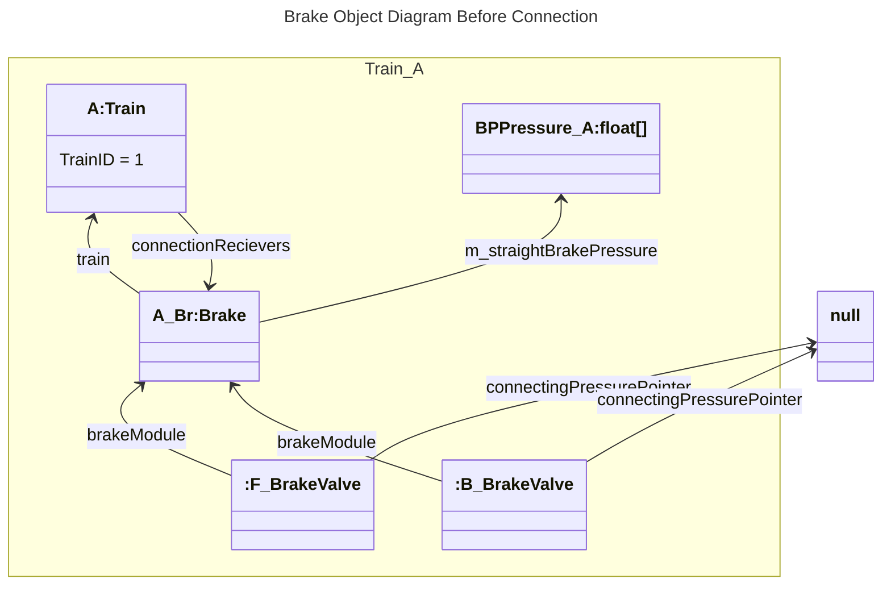
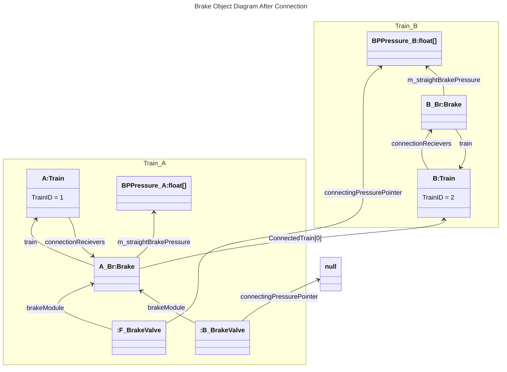
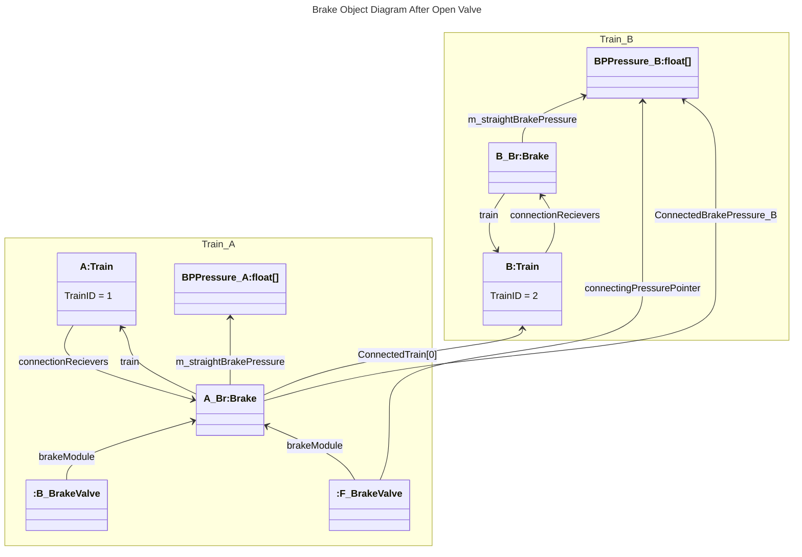

# RigidBody Udon Railway
## 概要
RigidBodyUdonRailwayはUdonとRigidBodyを用いてVRCワールドに操作可能な鉄道を敷くことを目的に開発さた、エディタスクリプト、U#スクリプト及びPrefabが含まれています。

使用にはFBXExporterが必要となります。　https://docs.unity3d.com/ja/Packages/com.unity.formats.fbx@4.1/manual/index.html

# 目次
- [ビルドプロセス](#ビルドプロセス)
- [コンポーネント](#コンポーネント)
    - [レール関係](#レール関係)
        - [Editor](#--editor)
        - [Runtime(VRC)](#--runtimevrc)
    - [車両関係](#車両関係)
        - [Editor](#--editor-1)
        - [Runtime(VRC)](#--runtimevrc-1)
- [プレハブ](#prefab)
# ビルドプロセス
参照を同期する必要からビルドプロセスにて全レール、列車を配列登録しています。

他に連結器参照の自動設定や、走行用コンポーネントの設定値変更が今後増える可能性があります。

## RailManager_onEditor
- シーンルートにあるRailsManagerを探索します
- 全Rail_Scriptを収集し、レールリストにします。
    - RailsManagerにレールリストを登録します。
    - Rail_Scriptに対してレールリスト上のIndexを渡します。
- 全Rail_Scriptの子として、RailsManagerのパラメーターに基づきメッシュコライダーを生成します。（WheelCollider用）
## TrainManager_onEditor
- シーンルート上にあるtrainManager,RailsManagerを探索します
- 全Trainを収集し、レールリストにします。
    - Trainにレールリストを登録します。
    - Trainに対してレールリスト上のIndexを渡します。
    - Trainに対してtrainManager,RailsManagerを渡します。

# コンポーネント
# レール関係

- レールモデルを敷くために用意された編集用スクリプトと、VRC内で車両にレールデータを受け渡す物

## - Editor
### - railModelTiler

モデル敷設スクリプト。
カーブや中途半端な長さのレールを敷設するために使用します。
<details>
<summary>設定値及び機能</summary>

|設定値|概要|
|---:|:---|
cinemachinePath|敷設先Path。これに沿ってモデル変形し、子オブジェクトを配置します
meshrendererObjectPrefab|敷設する元メッシュ。<br>Rootオブジェクトのメッシュが変形されます<br>FBXモデルを用いる場合、Read/Writeにチェックを入れること。<br>なお、敷設時、Rootオブジェクトの回転は無視されます。
modelLength|meshrendererObjectPrefabで設定したメッシュの長さ([m])。
TilingStart|敷設開始点
TilingEnd|敷設終点
isZinverted|MeshRendererObjectが-Zに伸びているか。<br>-Z方向に伸びている場合にチェックを入れないと始端終端がおかしくなります。
ignoreRoll|ロール無視。<br>CinemachinePathが捻られている時、それを無視してワールドXZ平面に垂直を保って敷設します。
ignorePitch|ピッチ無視。<br>CinemachinePathが捻られている時、それを無視してワールドXZ平面に並行を保って敷設します。<br>位置変位は保たれるため、平行四辺形変形された形になります。
disbaleInstancedThreshold|インスタンス解除頂点変位閾値([m])。<br>この設定値を越えて頂点が移動された場合、インスタンス解除され頂点をPathに沿って変形したモデルが設定されます。<br>※インスタンス：元モデルメッシュを参照複製して用いる。生成メッシュが減り容量が軽くなる、GPUInstancingが効く等の恩恵あり）
saveFolder|セーブ先フォルダ。/で階層を表す
veticesTransformSteps|1ループで扱う頂点量<br>エディタ拘束を避けるため、多ループに跨がらせています。上げることで高速化が見込めますが、敷設中頻繁にフリーズするようになります。
root|Cinemachine一括オフセット機能で用いる親オブジェクト
offset|レールモデル位置オフセット<br>Cinemachine一括オフセット量

|機能|概要|
|---:|:---|
TilingRails|TilingStart->TilingEndの区間でレール生成を行います
TilingRailAll|cinemachinePathの始点から終点までの区間でレール生成を行います
Cancel|生成を強制停止します<br>GameObject削除は行われず、生成途中の物が残りますが、Meshはセーブされていないためこの状態で保存しても消えてしまいます。
SelectFolder|フォルダ選択画面を開きます。<br>新規フォルダ生成をこの先の画面で行うとUnityがフォルダを認識できず無限ループしてしまう不具合が報告されています。既存のフォルダを選択するようにしてください。
Offset|Cinemachine一括オフセットを行います。
</details>

### - railModelLocator

モデル配置スクリプト
<details>
<summary>設定値及び機能</summary>

|設定値|概要|
|---:|:---|
cinemachinePath|敷設先Path。これに沿ってオブジェクトを配置します
objectPrefab|敷設するオブジェクト。プレハブ化必須。
modelLength|モデル配置間隔
TilingStart|配置始点
TilingEnd|配置終点
isZinverted|（このスクリプトではあまり意味の無いパラメーターです）
ignoreRoll|ロール無視。<br>CinemachinePathが捻られている時、それを無視してワールドXZ平面に垂直を保って設置します。
ignorePitch|ピッチ無視。<br>CinemachinePathが捻られている時、それを無視してワールドXZ平面に並行を保って設置します。


|機能|概要|
|---:|:---|
TilingRails|TilingStart->TilingEndの区間で配置を開始します
Cancel|配置を強制停止します。残ったオブジェクトはそのまま使用可能です。
</details>

### - railModelTiler_Batcher

railModelTiler一括実行スクリプト。 指定されたpath全体にレールを生成します。
<details>
<summary>設定値及び機能</summary>

|設定値|概要|
|---:|:---|
railModelTiler|バッチ処理を担当するrailModelTiler
batchingRoot|バッチ処理されるpathたちの親オブジェクト<br>設定されていると子にあるpath全てに対し生成を行います。
batchingObject|バッチ対象のpath。batchingRootが設定されていると無視されます。

|機能|概要|
|---:|:---|
Batching|バッチ処理を開始します。
Cancel|バッチ処理をキャンセルします。その時点で動いている敷設処理はそのまま動き続けます。
</details>

## - Runtime(VRC)
- Rail_Script

レールスクリプト。始点と終点双方のレール参照を保持し、車両に次のレールを伝えます。

<details>
<summary>設定値/仕様</summary>

|設定値|概要|
|---:|:---|
cinemachinePath|レールとするcinemachinePath。Smooth/通常両方使えます。
moveableRail|移動するレールか。<br>チェックされていると載っている列車は常に情報を更新します。
next|path終点側接続レール
prev|path始点側接続レール

Gizmoについて：

前後レールの設定がある場合、Gizmoは \\/ (レール部分) \\/ のような形になります。

前後レールの設定が無い場合、Gizmoは◯--◯ (レール部分) ◯\/のような形になります。

設定したレール間が離れていると、巨大な球が描画されます。
</details>

### - RailsManager

レール管理スクリプト。

ビルド時自動設定が行われます。

同期のために設置が必要です。シーンルート直下に配置してください。

またこのコンポーネントの設定に基づきレールに対してコライダーが生成されます。

<details>
<summary>設定値/仕様</summary>

|設定値|概要|
|---:|:---|
railColliderMaxLength|レールコライダーの最大長。これを越えているレールは収まる大きさに分割されます。
railFaceMaxDivide|レールメッシュコライダーの分割数（将来的なポリゴン数最適化が行われる可能性があります）
railFaceWidth|レールメッシュコライダーの幅
railColliderLayerName|レールコライダーのレイヤー名。未設定の場合はDefaultが使われます。
</details>

### - RailroadCrossing

踏切スクリプト

JointSoundPlayerを検出し、範囲内に列車が進入/退出するとAnimatorのパラメーターを書き換えます。

<details>
<summary>設定値/仕様</summary>

|設定値|概要|
|---:|:---|
animators|設定先Animator。複数指定可能です。
paramName|書き換えるパラメーター(bool,in=true,out=false)
</details>

### - PointLever_Setter

Animator連携式ポイントスクリプト

Animatorからのイベント発火で駆動し、レールの参照を書き換えて分岐切り替えを行います

<details>
<summary>設定値/仕様</summary>

|設定値|概要|
|---:|:---|
from1|分岐元レール<br>changeTypeで指定した側のレールが切り替えになります
from2|分岐元レール(サブ)
changeType1 | bool , next=true , prev=false
changeType2 | bool , next=true , prev=false
to1|切り替え先レール(state=false)
to2|切り替え先レール(state=true)
state|分岐状態保存変数。この値は同期されます

|仕様|概要|
|---:|:---|
Animatorイベント|AnimatorとUdonが同じオブジェクトに付いている場合、AnimatorからSendCustomEventを呼ぶことが出来ます。<br>引数としてStringを指定し、これでUdonのメソッドを呼べます。
ポイント転換|上記方法でSetRoute1,SetRoute2を呼ぶことで、全プレイヤーのインスタンスで転換されます。（同期はスクリプト側で取っています）

</details>

### - TurnTable_Controller

Animator連携式転車台スクリプト

Animatorの"mortorTorque"[float]パラメーターを参照し、mortorTorqueの速度と正負でレール(正確にはGameObject)を旋回、前後レールの参照を自動設定します。

同じオブジェクトにVRCStationをアタッチする必要があります。

Interactで動作開始します。

<details>
<summary>設定値/仕様</summary>

|設定値|概要|
|---:|:---|
targetTable|旋回するオブジェクト
mine|旋回するレールのスクリプト
targets|転車台周囲にあるレール<br>mineにむけ参照を持っている想定で組まれています。
animator|"mortorTorque"[float]パラメーターの参照先になるAnimator
syncedTableRotation|初期回転位置からの差分。同期に使用
Active|動作状態。同期に使用
</details>

# 車両関係
- 走行・連結用スクリプトと、独立した音源他アクセサリスクリプト
## - Editor
## - Runtime(VRC)
### - Train
    
列車基本スクリプト
<details>
<summary>設定値及び仕様</summary>

|設定値|概要|
|---:|:---|
TrainID|車両識別番号（ビルド時自動設定）
TrainManager|車両管理スクリプト（ビルド時自動設定）
RailsManager|レール管理スクリプト（ビルド時自動設定）
Started|初期化フラグ(False必須)
BrakeMultiplier|ブレーキ力係数 max=BrakeMultiplier[N]
BrakeFactor|実効ブレーキ力。実行時debug用
useLegacyBrakeForce|RigidBodyWheelを用いず旧来のブレーキ処理を用いるか（デフォルト true）
baseBrakePressure|ブレーキ圧の参照値　この値を下回るとブレーキが掛かります。<br>baseBrakePressure*0.72で最大ブレーキ力。
friction|摩擦力。動静通して掛かる。[N]<br>brakeUpdateBypass=falseでは無効です。
static_friction|静止時摩擦力。[N]<br>brakeUpdateBypass=falseでは無効です。
CenterOfMass|重心位置設定
BrakeOpenF|+Z側のブレーキ開放状態。連結時ブレーキ圧の伝達を受けるかどうか
BrakeOpenB|-Z側のブレーキ解放状態。連結時ブレーキ圧の伝達を受けるかどうか
CouplerF|+Z側連結器。オーナー同期に用います。
CouplerB|-Z側連結器
controllerAnimator|設定の入出力Animator。
connectionRecievers|連結関係の情報を受け取るUdon
Rigidbody_Speed_LocalZ|外部制御スクリプトで車速を利用する際に用いる長さ1配列。
connectedTrain_F|+Z側連結車両(初期化時自動設定)
connectedTrain_B|-Z側連結車両
Bogie_F|+Z側台車中心
BogieWheel_F|+Z側台車オブジェクト
RailID_F|+Z側台車が載っているレールの識別子。実行時debug用
BogieRail_F|+Z側台車が載っているレール
Bogie_B|-Z側台車中心
BogieWheel_B|-Z側台車オブジェクト
RailID_B|-Z側台車が載っているレールの識別子。実行時debug用
BogieRail_B|-Z側台車が載っているレール
InitsyncRecieveMode|初期化同期受信モード(True必須)


|機能|概要|
|---:|:---|
controllerAnimatorについて|必須パラメータと機能を示します。<br>inはTrainへの入力、outはTrainからの出力を表します
out)RigidBodySpeed|車両の速度です。+Z方向を正、単位は[m/s]/100です。(motionTimeでの扱いを想定しているため)
----------|---------
連結器処理の仕様|連結が行われると、Train.csをアタッチしたオブジェクトのConfigurable Jointに自分の連結器位置と連結対象車両の連結器位置を用いて自動でAnchorの設定が行われ、またOwnerが移行されます。
----------|---------
BogieWheel、Bogie|BogieWheelオブジェクトは実行中常にBogieに最も近いレール上に合わせられます。この時車両をレール上に拘束するのはRigidBodyのJointを用いています。
----------|---------
Owner周りの仕様|Owner変更が行われると、前後の車両に直ちに伝播します。
----------|---------
同期について|同期は連結された前後1両の車両のみが行います。

</details>

### - AbstractBrake
ブレーキ系のベースクラスです。
<details>
<summary>設定値及び仕様</summary>

|設定値|概要|
|---:|:---|
train|ブレーキを付けた車両です。Noneのままであればビルド時に親オブジェクトが自動設定されます。
straightBrakePressure|制御・動作用の直通管圧です。
UseLegacyPipeState|ブレーキ管の開閉をこのオブジェクトから制御するかどうか
BrakeOpenF/B|UseLegacyPipeState=trueの場合、ブレーキ管の開閉初期設定になります。実行中の開閉は [BrakeConnectorValve](#--brakeconnectorvalve) で制御されています。
indicateAnimator|圧力出力先のAnimatorです。(BrakePressure[MPa])
indicateUdons|管開閉状態表示用のUdonです。

|関数|概要|
|---:|:---|
math_sqrt_2_q_Q_div_m|ブレーキ管の圧力計算に用いている関数です。２圧室の圧力を与え、戻り値に係数を掛けて使います。<br>係数は$10^3 S/(L\sqrt{m})$、<br>S:断面積<br>L:体積<br>m:密度定数 = $11.5075252899[kg/m³*MPa]$
getStraightPressurePointer|直通管の疑似ポインタ(長さ1の配列)を返します。
setConnectedPressurePointer|接続している直通管を設定します。
ConnectionDebug|デバッグ用のStringを生成して返します。


開発者向け参考：オブジェクト参照図



</details>

### - MortorAndWheel
    
力行・制動の剛体車軸スクリプト
使用方法はプレハブ章のRB_Wheelを参照

<details>
<summary>設定値及び仕様</summary>

|設定値|概要|
|---:|:---|
WheelTreadSpeed|円周上の速度（粘着時WheelTreadSpeed=RigidBodySpeed）
index|WheelTreadSpeed[index]で速度書き込みを行う
MortorForce|回転力。円周上における力[N]。
BrakeForce|ブレーキ力。円周上における力[N]。
Friction|摩擦力。[0]=静止、[1]、動。
rb|親RigidBody（通常はTrain）
wheel|車軸となるRigidBody
brake|ブレーキシューとなるRigidBody
WheelPressure|車両から押し付けられる力(仮想。RigidBody経由のものではない)

</details>

### - TrainManager

車両集中管理用スクリプト

ビルド時自動設定が行われるため、設置のみ必要です。シーンルート直下に配置してください。

<details>
<summary>設定値及び仕様</summary>

|設定値|概要|
|---:|:---|
Trains|シーン上に存在する全ての車両 SetByBuildScript
pathRes|CinemachinePathからの計算精度　下げると向上しますがその分若干重くなります。<br>なお現在は接線から計算する処理を混ぜている為、0設定でもそこまで問題になりません。
railsManager|レール管理スクリプト SetByBuildScript 同期処理で参照します

</details>

### - CouplerObj
連結スクリプト
<details>
<summary>設定値及び仕様</summary>

|設定値|概要|
|---:|:---|
TrainScript|自身を装備している車両本体のスクリプト
Knuckle_Closed|ナックル開閉状態
state|連結器状態 0=lock, 1=unlock, 2=open
CouplerAudioSource|音源再生に用いるAudioSource。
カプラ音源|対応イベント時にCouplerAudioSourceで再生されるAudioClip。
FrontOrBack|連結器方向。 +Z=Front
disconnectForce|連結器開放に必要な力
connectedCoupler|連結している連結器
knuckleModel|ナックルのモデルオブジェクト。閉y=0,開y=90に回転されます。
knuckleKey|予約済みフィールド（未使用）

|機能|概要|
|---:|:---|
Editor上での連結|Editor上でconnectedCouplerを指定しておくことで連結状態を設定しておくことが出来ます。
突放貨車向けの調整|disconnectForceを大きめにすることで、動き出し衝動で外れるのをある程度防止できます

</details>

### - BrakeConnectorValve

ブレーキ管開閉スクリプト
<details>
<summary>設定値及び仕様</summary>
Colliderを設定することで、Interactによる簡易な操作ボタンとしても使用することができます。

|設定値|概要|
|---:|:---|
brakeModule|パイプの開閉操作対象のブレーキ装置。Noneのままにした場合、取り付けた車両が持っている物に自動設定されます。
PipeName|パイプ名称。ブレーキ装置側で解釈され、AbstractBrakeは"BP"管を持っています。
F_B|前後設定。trueが前(F)です。親が連結器の場合、自動設定されます。
OpenState|開閉状態。

|関数|概要|
|---:|:---|
OpenBrakeValve|対象のブレーキ管を開きます
CloseBrakeValve|対象のブレーキ管を閉じます
(Interact)|対象のブレーキ管の開閉を切り替えます

</details>

### - FlangeSoundPlayer

フランジ音を再生するスクリプト
<details>
<summary>設定値及び仕様</summary>

|設定値|概要|
|---:|:---|
trainBody|列車のRigidBody
wheelBody_transform|Trainで指定しているWheelオブジェクト
FlangeSound|フランジの音源
DotThreshould|フランジ音の再生を開始する押圧閾値
MagnitudeThreshould|フランジ音の再生を開始する速度閾値

|機能|概要|
|---:|:---|
仕様|Wheelの方向=レール方向と車両の移動方向の差から、内積を計算し、横方向の速度を計算します。単位はm/s
----------|DotThreshouldは横方向の閾値、MagnitudeThreshouldは前後方向の閾値。両方を超えているとフランジ音が再生されます。
----------|音量は横方向の速度に比例しますが、音量はDot-DotThreshouldになっています。

</details>

### - ResyncSwitch

強制再同期用スクリプト

<details>
<summary>設定値及び仕様</summary>

|設定値|概要|
|---:|:---|

TrainManager|実際の同期処理を行う管理スクリプト

|機能|概要|
|---:|:---|
同期の流れ|Interact->TrainManager同期イベント発火<br>->ローカル車両を強制同期待機モードへ,全車両オーナーへ同期データ送信リクエスト<br>->同期データ受信後補完無しで適用

</details>

# Prefab
## Train_Prefab
<details>
    <summary>設定値及び仕様</summary>

## 内部図
```
    Train_Prefab
    ├── Train ----------------- [Train.u#] [RigidBody] [Configurable Joint(CouplerJoint)]*2
    │   ├── Rigidbody_Box ----- [NonTrigger Collider]
    │   ├── Bogie_Front ------- [Transform]
    │   ├── Bogie_Back -------- [Transform]
    │   ├── FCouplerObj ------- [CouplerObj.u#]
    │   └── BCouplerObj ------- [CouplerObj.u#]
    ├── BrakeModule ----------- [AbstractBrake.u#]
    ├── WheelF ---------------- [RigidBody] [Configurable Joint(BogieJoint)]
    └── WheelB ---------------- [RigidBody] [Configurable Joint(BogieJoint)]
```
## 参照図
```
    ()は実行時/ビルド時自動参照
    Train [Train.u#]
            ├── ([RigidBody])
            ├── Bogie_F : Bogie_Front ------------- [Transform]
            ├── Bogie_B : Bogie_Back -------------- [Transform]
            ├── CouplerF : FCouplerObj ------------ [CouplerObj.u#]
            ├── CouplerB : BCouplerObj ------------ [CouplerObj.u#]
            ├── BogieWheel_F : WheelF ------------- [RigidBody]
            ├── BogieWheel_B : WheelB ------------- [RigidBody]
            └── connectionRecievers
                ├── (BrakeModule - [BrakeModule.u#])
                ├── (FCouplerObj/BrakeConnectorValve - [BrakeConnectorValve.u#])
                └── (BCouplerObj/BrakeConnectorValve - [BrakeConnectorValve.u#])

    FCouplerObj,BCouplerObj
        [CouplerObj.u#]
            ├── (TrainScript:Train [Train.u#])
            └── (Train [Configurable Joint(CouplerJoint)])

    WheelF,WheelB [Configurable Joint(BogieJoint)]
                    └── Train [RigidBody]
```
## 使用方法
0. シーン上にレールを敷き、TrainManagerの付いたオブジェクトを用意しておく
1. Train_Prefabをシーン上に設置
    1. Train下にモデルを挿入
    2. シーンに敷いてあるレール上に移動
    3. Trainの角度をレールに合わせる
    - Train_Prefab自体を回転させると浮動小数点演算誤差の問題が出やすくなるので非推奨。
2. 位置参照を合わせる
    1. Bogie_Front/Backの位置をレール踏面・台車中心に移動
    2. WheelF/Bの位置をBogie_Front/Backに合わせる
    3. WheelF/Bの[Configurable Joint]のConnected AnchorをBogie_Front/BackのLocalPosition(Inspector上表示値)に合わせる。
3. シーン上オブジェクトを参照する
    1. [Train.u#]のBogieRail_F/Bにそれぞれシーン上のレールを設定
    2. アニメーション制御の場合はcontrollerAnimatorに任意のAnimatorを設定
    3. 他車と連結する場合、CouplerF/B[CouplerObj.u#]のconnectedCouplerに対応する他車Coupler[CouplerObj.u#]を設定。

</details>

## RB_Wheel
<details>
    <summary>設定値及び仕様</summary>

## 内部図
```
    RB_Wheel ------------------ [MortorAndWheel.u#]
    ├── Wheel ----------------- [RigidBody] [Sphere Collider] [Configurable Joint]
    └── WheelBrake ------------ [RigidBody] [Sphere Collider] [Configurable Joint]*2
```
## 参照図
```
    ()は実行時自動参照
    RB_Wheel [MortorAndWheel.u#]
            ├──(WheelTreadSpeed ----- [float[]])
            ├── rb : Train ---------- [RigidBody]
            ├── Wheel : Wheel ------- [RigidBody]
            └── Brake : WheelBrake -- [RigidBody]

    Wheel [RigidBody]
            └── Configurable Joint
                    └── ConnectedBody : Train -- [RigidBody]

    WheelBrake [RigidBody]
            ├── Configurable Joint
            │       └── ConnectedBody : Train -- [RigidBody]
            └── Configurable Joint
                    └── ConnectedBody : Train -- [RigidBody]
```
## 使用方法
0. Train_Prefabをシーン上に設置しておく
1. Wheel,WheelBrakeの各JointのConnectedBodyにtrainのRigidBodyを設定する
2. WheelPressureへ車体から掛かっているべき力を設定する。単位は[N]（Springは用いていない）
3. 必要に応じて半径とBrake、Wheelの位置を調整する
4. 必要に応じて力行・ブレーキ制御を行うUdonに設定を行う

## API

数値類が配列になっているため、参照渡しを活用してオブジェクトを跨いだやり取りを高速に行うことができる。

Update内でMortorForce、BrakeForceの0番数値を用いて力行・停止制御を行う（実行順保障ナシ、パフォーマンス的にはシミュレーションの類はなるべくFixedUpdateを避けるべきなため）

WheelTreadSpeedはStart等で任意の長さの配列を持たせ、index指定することで一次元配列で管理が可能